# Bau de Tesouros PSOF
Este projeto é uma aplicação web utilizando o padrão MVC (Model-View-Controller) com foco em manipulação do DOM no JavaScript.
# 💎 Plataforma Baú de Tesouros  

### Projeto de Software – Desenvolvimento de Sistemas  
**Autores:** Beatriz Gabriela Barbosa e Adrielly Dantas de Oliveira  
**Orientador:** Prof. Celso  
**Instituição:** Luiz Varga – Limeira/SP  


## 🧭 1. Introdução  

### 1.1 Visão Geral  
A sociedade contemporânea enfrenta um grave desafio relacionado ao consumo excessivo e ao descarte inadequado de produtos, especialmente entre o público infantil. Brinquedos, roupas e livros são frequentemente substituídos antes de atingirem o fim de sua vida útil, resultando em acúmulo de resíduos e desperdício de recursos.  

Segundo a **Associação Brasileira de Indústria de Brinquedos (ABRINQ)**, cerca de **80% dos brinquedos produzidos no Brasil são descartados em menos de dois anos de uso**, e apenas **3%** são reaproveitados ou doados. Além disso, dados do **IBGE (2023)** indicam que o Brasil gera mais de **80 milhões de toneladas de resíduos sólidos por ano**, sendo o consumo infantil responsável por uma parcela crescente desse total.  

Diante desse cenário, o projeto **Baú de Tesouros** surge como uma proposta de **educação ambiental e incentivo à economia circular**, promovendo o reaproveitamento de itens infantis e a conscientização sustentável desde a infância.


## 🌍 2. Descrição do Projeto e da Solução  

O **Baú de Tesouros** é um **site interativo** que possibilita a **venda, doação e troca** de brinquedos, roupas, livros e outros objetos infantis em bom estado de conservação.  

A plataforma permite que famílias cadastrem seus itens com fotos, descrições e opções de transação (venda, doação ou troca). Os usuários podem visualizar produtos disponíveis, manifestar interesse, contatar o proprietário e efetivar trocas ou aquisições.  

Além de facilitar o reaproveitamento, a plataforma possui um caráter **educativo e social**, incentivando o consumo consciente e a colaboração entre famílias.  


## 🧱 3. Estrutura do Site e Ferramentas Utilizadas  

O sistema será desenvolvido como uma aplicação **web responsiva**, empregando a manipulação dinâmica da interface via **método DOM (Document Object Model)**.  

### 3.1 Tecnologias e Ferramentas  
- **Frontend:** HTML5, CSS3 e JavaScript (manipulação DOM)  
- **Backend:** Node.js (para testes e futuras integrações)  
- **Prototipagem:** Figma  
- **Gerenciamento de Código:** GitHub  
- **Editor de Desenvolvimento:** Visual Studio Code  


## ⚙️ 4. Funcionalidades Principais  

### 4.1 Menu de Navegação  
1. **Início:** página principal com destaques e novidades.  
2. **Venda:** cadastro e exibição de itens disponíveis para venda.  
3. **Doação:** listagem de produtos destinados à doação.  
4. **Troca:** nova funcionalidade que permite a negociação direta entre usuários.  
5. **Contato:** formulário para comunicação com administradores.  
6. **Perfil:** área do usuário com histórico, configurações e gerenciamento de produtos.  

### 4.2 Funcionalidades Centrais  
- **Barra de Pesquisa:** permite busca por nome, tipo, categoria ou usuário.  
- **Sacola Virtual:** armazena temporariamente os itens de interesse.  
- **Confirmação de Interesse:** formulário que formaliza a intenção de compra, troca ou doação.  
- **Histórico de Transações:** acompanhamento de negociações realizadas.  


## 🧩 5. Requisitos do Sistema  

### 5.1 Requisitos Funcionais  
1. Cadastro, login e gerenciamento de usuários.  
2. CRUD completo de itens (criar, visualizar, editar e excluir).  
3. Pesquisa e filtragem por categoria.  
4. Módulo de troca entre usuários.  
5. Adição e remoção de itens na sacola virtual.  
6. Formulário de confirmação de interesse.  
7. Exibição de novos itens na tela inicial.  
8. Histórico e avaliações de transações.  

### 5.2 Requisitos Não Funcionais  
1. **Desempenho:** tempo de resposta inferior a 2 segundos.  
2. **Segurança:** criptografia de dados e conformidade com a **LGPD**.  
3. **Compatibilidade:** navegadores modernos (Chrome, Edge, Safari).  
4. **Acessibilidade:** interface conforme **WCAG 2.1**.  
5. **Responsividade:** suporte a desktop, tablet e dispositivos móveis.  


## 🎭 6. Casos de Uso  

### 6.1 Caso de Uso – Cadastro de Usuário  
**Ator:** Usuário Responsável (pai/mãe)  
**Descrição:** Criação de perfil pessoal e vinculação à conta da criança.  

### 6.2 Caso de Uso – Cadastro de Novo Item  
**Ator:** Usuário Responsável  
**Descrição:** Inserção de item com fotos, descrição, tipo de transação (venda, doação ou troca) e informações de localização.  

### 6.3 Caso de Uso – Confirmação de Interesse  
**Ator:** Usuário Responsável  
**Descrição:** O usuário manifesta interesse por um item e preenche o formulário de confirmação de troca, doação ou compra.  

### 6.4 Caso de Uso – Problemas e Responsabilidade  
**Descrição:**  
Em casos de **extravio ou falhas de entrega**, o **Baú de Tesouros não se responsabiliza pelo transporte ou perdas**, sendo de responsabilidade dos usuários manter contato direto com o fornecedor ou serviço de correio.  


## 💰 7. Especificação de Modelo Lucrativo e Custo-Benefício  

O projeto adota um **modelo de impacto social** com baixo custo operacional e potencial de sustentabilidade financeira.  

### 7.1 Custos Principais  
- Hospedagem e manutenção da plataforma;  
- Suporte técnico e pequenas atualizações;  
- Divulgação em redes sociais.  

### 7.2 Benefícios  
- Redução do descarte de brinquedos e roupas infantis;  
- Promoção do consumo consciente;  
- Fortalecimento da economia circular e de redes solidárias.  

### 7.3 Fontes de Receita Futuras  
- **Planos premium:** para anúncios em destaque.  
- **Parcerias com ONGs, escolas e marcas sustentáveis.**  
- **Editais e apoios públicos** ligados à educação ambiental.  
- **Doações voluntárias** de usuários engajados.  
- **Publicidade responsável** de produtos alinhados ao propósito.  


## 🧮 8. Diagramas do Sistema   

### 8.1 Diagrama de Fluxo  

```mermaid
graph TD

A[Usuário acessa o site] --> B[Login ou Cadastro]
B --> C[Escolher ação: Venda, Doação ou Troca]
C --> D[Formulário de cadastro de item]
D --> E[Publicar item]
E --> F[Item listado no catálogo]
F --> G[Outro usuário manifesta interesse]
G --> H[Formulário de confirmação]
H --> I[Negociação concluída]

```

### 8.2 Diagrama de Casos de Uso

```mermaid

graph TD

  subgraph Atores
    U[Usuário Responsável]
    V[Visitante / Interessado]
    ADM[Administrador]
    P[Parceiros: Escolas/ONGs]
  end

  subgraph Sistema["Baú de Tesouros - Sistema"]
    CU1["Cadastro e Autenticação"]
    CU2["Publicar Item (CRUD)"]
    CU3["Buscar e Filtrar"]
    CU4["Adicionar à Sacola"]
    CU5["Formulário de Interesse"]
    CU6["Proposta de Troca"]
    CU7["Doação"]
    CU8["Avaliação e Feedback"]
    CU9["Painel Administrativo"]
  end

  U --> CU1
  U --> CU2
  U --> CU4
  V --> CU3
  V --> CU5
  V --> CU6
  U --> CU8
  ADM --> CU9
  P --> CU7
  CU5 --> CU2
  CU6 --> CU2

```

### 8.3 Diagrama de Classes


### 8.4 Diagrama de Atores
```mermaid
graph LR

  U[Usuário Responsável] -->|publica| S[Plataforma]
  V[Visitante] -->|procura| S
  S -->|notifica| U
  ADM[Administrador] -->|modera| S
  ONG -->|parceria| S
  ```